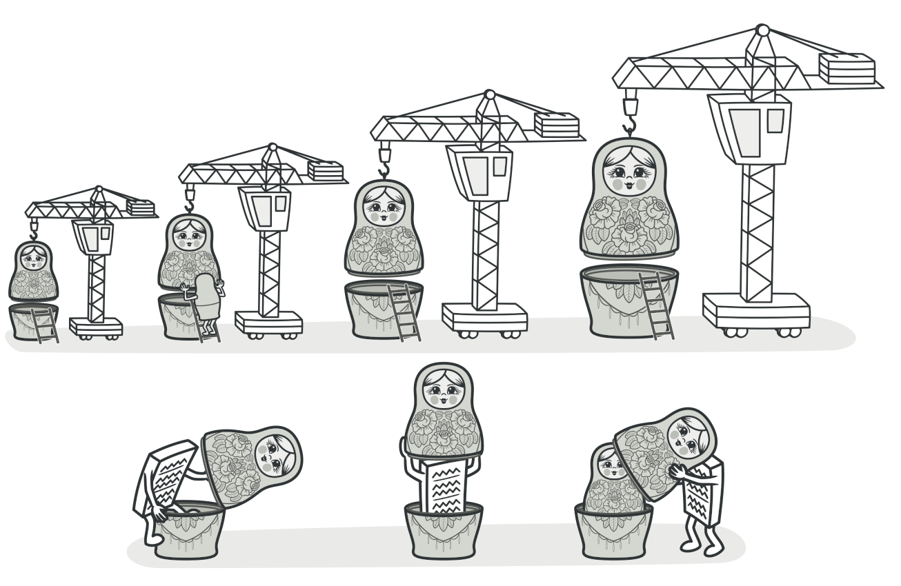
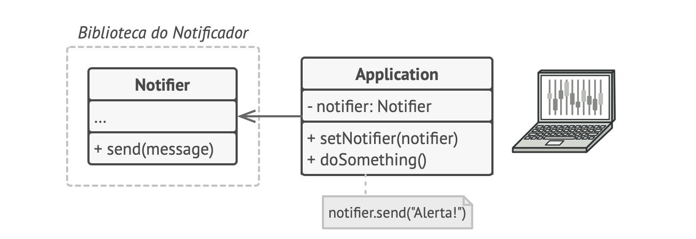
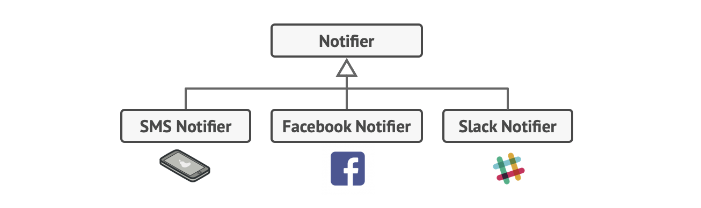
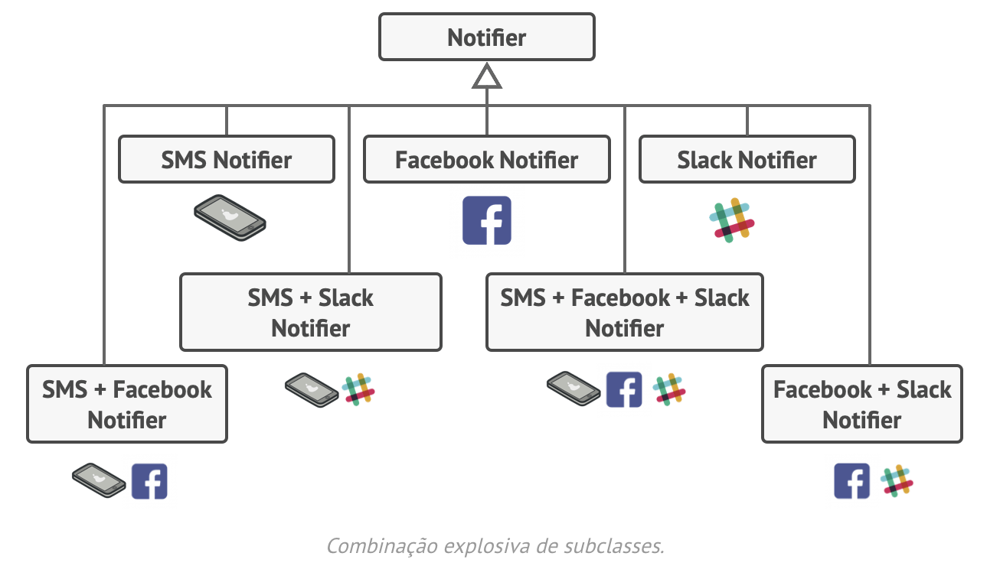
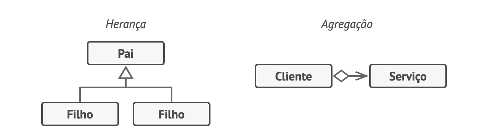

# Decorator

## Propósito

O **Decorator** é um padrão de projeto estrutural que permite que você acople novos comportamentos para objetos ao colocá-los dentro de invólucros de objetos que contém os comportamentos.

## Problema

Imagine que você está trabalhando em um biblioteca de notificação que permite que outros programas notifiquem seus usuários sobre eventos importantes.

A versão inicial da biblioteca foi baseada na classe `Notificador` que tinha apenas alguns poucos campos, um construtor, e um único método `enviar`. O método podia aceitar um argumento de mensagem de um cliente e enviar a mensagem para uma lista de emails que eram passadas para o notificador através de seu construtor. Uma aplicação de terceiros que agia como cliente deveria criar e configurar o objeto notificador uma vez, e então usá-lo a cada vez que algo importante acontecesse.

Em algum momento você se dá conta que os usuários da biblioteca esperam mais que apenas notificações por email. Muitos deles gostariam de receber um SMS acerca de problemas críticos. Outros gostariam de ser notificados no Facebook, e, é claro, os usuários corporativos adorariam receber notificações do Slack.

Quão difícil isso seria? Você estende a classe `Notificador` e coloca os métodos de notificação adicionais nas novas subclasses. Agora o cliente deve ser instanciado à classe de notificação que deseja e usar ela para todas as futura notificações.

Mas então alguém, com razão, pergunta a você, “Por que você não usa diversos tipos de notificação de uma só vez? Se a sua casa pegar fogo, você provavelmente vai querer ser notificado por todos os canais.”

Você tenta resolver esse problema criando subclasses especiais que combinam diversos tipos de métodos de notificação dentro de uma classe. Contudo, rapidamente você nota que isso irá inflar o código imensamente, e não só da biblioteca, o código cliente também.

## Solução

Estender uma classe é a primeira coisa que vem à mente quando você precisa alterar o comportamento de um objeto. Contudo, a herança vem com algumas ressalvas sérias que você precisa estar ciente.

- A herança é estática. Você não pode alterar o comportamento de um objeto existente durante o tempo de execução. Você só pode substituir todo o objeto por outro que foi criado de uma subclasse diferente.
- As subclasses só podem ter uma classe pai. Na maioria das linguagens, a herança não permite que uma classe herde comportamentos de múltiplas classes ao mesmo tempo.

Uma das maneiras de superar essas ressalvas é usando _Agregação_ ou _Composição_ ao invés de _Herança_ . Ambas alternativas funcionam quase da mesma maneira: um objeto _tem uma_ referência com outro e delega alguma funcionalidade, enquanto que na herança, o próprio objeto _é_ capaz de fazer a função, herdando o comportamento da sua superclasse.

Com essa nova abordagem você pode facilmente substituir o objeto “auxiliador” por outros, mudando o comportamento do contêiner durante o tempo de execução. Um objeto pode usar o comportamento de várias classes, ter referências a múltiplos objetos, e delegar qualquer tipo de trabalho a eles. A agregação/composição é o princípio chave por trás de muitos padrões de projeto, incluindo o Decorator. Falando nisso, vamos voltar à discussão desse padrão.

“Envoltório” (ing. “wrapper”) é o apelido alternativo para o padrão Decorator que expressa claramente a ideia principal dele. Um _envoltório_ é um objeto que pode ser ligado com outro objeto _alvo_ . O envoltório contém o mesmo conjunto de métodos que o alvo e delega a ele todos os pedidos que recebe. Contudo, o envoltório pode alterar o resultado fazendo alguma coisa ou antes ou depois de passar o pedido para o alvo.

Quando um simples envoltório se torna um verdadeiro decorador? Como mencionei, o envoltório implementa a mesma interface que o objeto envolvido. É por isso que da perspectiva do cliente esses objetos são idênticos. Faça o campo de referência do envoltório aceitar qualquer objeto que segue aquela interface. Isso lhe permitirá cobrir um objeto em múltiplos envoltórios, adicionando o comportamento combinado de todos os envoltórios a ele.

No nosso exemplo de notificações vamos deixar o simples comportamento de notificação por email dentro da classe `Notificador` base, mas transformar todos os métodos de notificação em decoradores.

## Aplicabilidade

- Utilize o padrão Decorator quando você precisa ser capaz de projetar comportamentos adicionais para objetos em tempo de execução sem quebrar o código que usa esses objetos.
- O Decorator lhe permite estruturar sua lógica de negócio em camadas, criar um decorador para cada camada, e compor objetos com várias combinações dessa lógica durante a execução. O código cliente pode tratar de todos esses objetos da mesma forma, como todos seguem a mesma interface comum.
- Utilize o padrão quando é complicado ou impossível estender o comportamento de um objeto usando herança.
- Muitas linguagens de programação tem a palavra chave `final` que pode ser usada para prevenir a extensão de uma classe. Para uma classe final, a única maneira de reutilizar seu comportamento existente seria envolver a classe com seu próprio invólucro usando o padrão Decorator.

## Relações com outros padrões

- O [Adapter](https://refactoring.guru/pt-br/design-patterns/adapter) fornece uma interface completamente diferente para acessar um objeto existente. Por outro lado, com o padrão [Decorator](https://refactoring.guru/pt-br/design-patterns/decorator), a interface permanece a mesma ou é estendida. Além disso, o _Decorator_ oferece suporte à composição recursiva, o que não é possível quando você usa o _Adapter_ .
- Com [Adapter](https://refactoring.guru/pt-br/design-patterns/adapter), você acessa um objeto existente por meio de uma interface diferente. Com [Proxy](https://refactoring.guru/pt-br/design-patterns/proxy), a interface permanece a mesma. Com [Decorator](https://refactoring.guru/pt-br/design-patterns/decorator), você acessa o objeto por meio de uma interface aprimorada.
- O [Chain of Responsibility](https://refactoring.guru/pt-br/design-patterns/chain-of-responsibility) e o [Decorator](https://refactoring.guru/pt-br/design-patterns/decorator) têm estruturas de classe muito parecidas. Ambos padrões dependem de composição recursiva para passar a execução através de uma série de objetos. Contudo, há algumas diferenças cruciais.
  Os handlers do _CoR_ podem executar operações arbitrárias independentemente uma das outras. Eles também podem parar o pedido de ser passado adiante em qualquer ponto. Por outro lado, vários _decoradores_ podem estender o comportamento do objeto enquanto mantém ele consistente com a interface base. Além disso, os decoradores não tem permissão para quebrar o fluxo do pedido.
- O [Composite](https://refactoring.guru/pt-br/design-patterns/composite) e o [Decorator](https://refactoring.guru/pt-br/design-patterns/decorator) tem diagramas estruturais parecidos já que ambos dependem de composição recursiva para organizar um número indefinido de objetos.
  Um _Decorador_ é como um _Composite_ mas tem apenas um componente filho. Há outra diferença significativa: o _Decorador_ adiciona responsabilidades adicionais ao objeto envolvido, enquanto que o _Composite_ apenas “soma” o resultado de seus filhos.
  Contudo, os padrões também podem cooperar: você pode usar o _Decorador_ para estender o comportamento de um objeto específico na árvore [Composite](https://refactoring.guru/pt-br/design-patterns/composite)
- Projetos que fazem um uso pesado de [Composite](https://refactoring.guru/pt-br/design-patterns/composite) e do [Decorator](https://refactoring.guru/pt-br/design-patterns/decorator) podem se beneficiar com frequência do uso do [Prototype](https://refactoring.guru/pt-br/design-patterns/prototype). Aplicando o padrão permite que você clone estruturas complexas ao invés de reconstruí-las do zero.
- O [Decorator](https://refactoring.guru/pt-br/design-patterns/decorator) permite que você mude a pele de um objeto, enquanto o [Strategy](https://refactoring.guru/pt-br/design-patterns/strategy) permite que você mude suas entranhas.
- O [Decorator](https://refactoring.guru/pt-br/design-patterns/decorator) e o [Proxy](https://refactoring.guru/pt-br/design-patterns/proxy) têm estruturas semelhantes, mas propósitos muito diferentes. Alguns padrões são construídos no princípio de composição, onde um objeto deve delegar parte do trabalho para outro. A diferença é que o _Proxy_ geralmente gerencia o ciclo de vida de seu objeto serviço por conta própria, enquanto que a composição do _decoradores_ é sempre controlada pelo cliente.

## Referência

- [https://refactoring.guru/pt-br/design-patterns/decorator](https://refactoring.guru/pt-br/design-patterns/decorator)
